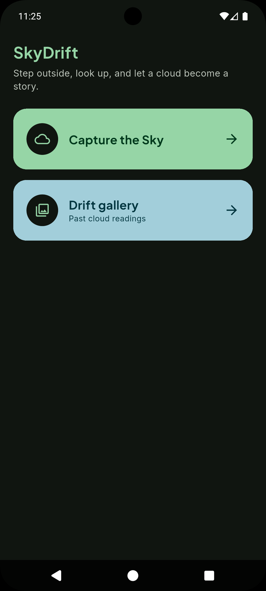
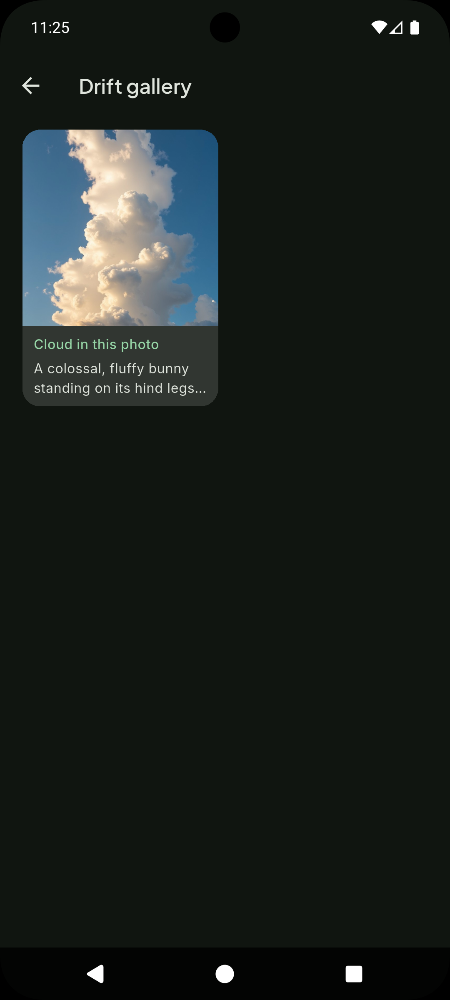
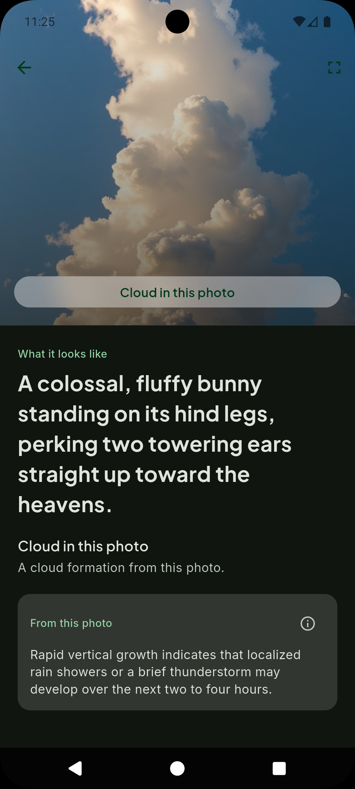
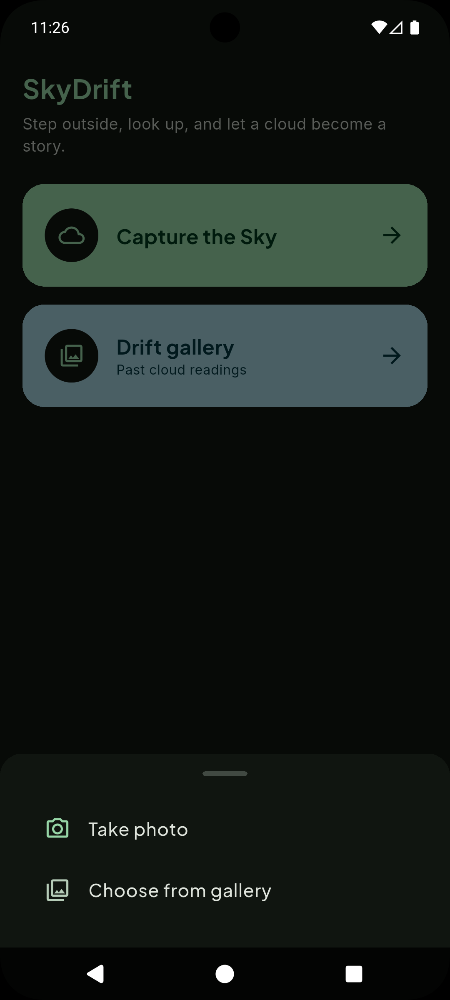

# SkyDrift — Mindfulness Sky-Gazing (Flutter)

A lightweight companion for looking up. Capture a cloud, get a short reading of the photo, and keep past drifts in a gallery.

## Highlights

📷 Capture the sky from the camera or gallery  
☁️ A reading of the photo: imagined shape and what the cloud suggests  
🖼️ Drift gallery of past readings  
🚀 Dev + Prod flavors (local API vs deployed API)  
🧱 Clean architecture with Bloc, Repository, and DI

## Screenshots

Screenshots are stored under `screenshots/` in the repository.

**Home Page**



**Gallery Page**



**Image Detail Page**



**Capture or Upload**



## Download APK

👉 [Download Latest Release](https://github.com/TusharSharmaIN/skydrift-app/releases/latest)

## Quick Start

### 1. Install dependencies

```bash
flutter pub get
```

### 2. Run (Dev)

```bash
flutter run --flavor dev -t lib/main_dev.dart
```

### 3. Run (Prod)

```bash
flutter run --flavor prod -t lib/main_prod.dart
```

### 4. Build Release APK

```bash
flutter build apk --flavor prod -t lib/main_prod.dart --release
```

## Notes

- Run codegen after model changes:

```bash
flutter pub run build_runner build --delete-conflicting-outputs
```

- Dev talks to a local API (`localhost:3000`, or `10.0.2.2:3000` on Android). Prod uses the deployed API.
- The sky reading is from the photo only — not a live forecast.

## Features

- Capture a cloud from the camera or gallery
- Analyze the photo into an imagined shape and a short reading
- Drift gallery of past readings
- Full-screen photo view
- Separate API hosts for dev and prod

## Architecture

- `presentation/` → UI pages & widgets
- `application/` → Bloc (state management)
- `domain/` → Entities & repository contracts
- `infrastructure/` → API, DTOs, repositories
- `flavor_config/` → Flavor + environment config
